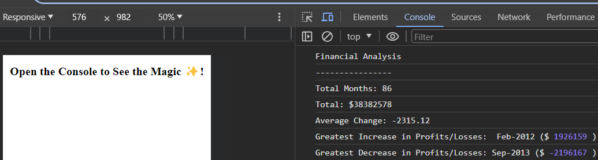
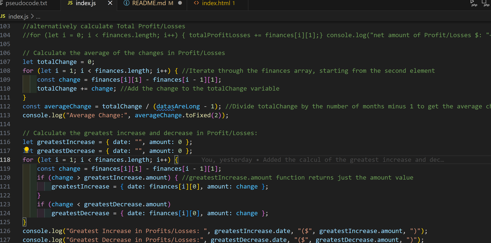

# Console-Finances data analysis 

## Description

The project deals with a financial analysis of a data set using javaScript. My motivation was to improve my programming skills in JavaScript using functions and/or code structures as clear as possible. An array type variable called finances is given with two records (date and amount) on the data of which I did the following:
- I have displayed the total number of months;
- I have displayed the total amount;
- I displayed the average amount variation;
- I displayed the largest increase in the variation of the amount and the date on which it occurred;
- I have displayed the largest decrease in the variation of the amount and the date on which it occurred;

## Installation

Running the Code
1. Open the `index.html` file in a web browser.
2. Open the browser's developer console (usually opening it in Google Chrome).
3. The financial analysis results will be displayed in the console.
My example:
https://andreea-lita.github.io/Console-Finances/ 

## Usage

Code Structure
- `index.html`: Contains the basic HTML structure and script tag to load the JavaScript code.
- `index.js`: Contains the JavaScript code that performs the financial analysis.
Some illustrative screenshot of the project, more specific teh results displayed nd some code after:

console-finances-piece-of code

(To add a screenshot, create an `assets/images` folder in your repository and upload your screenshot to it. Then, using the relative filepath, add it to your README using the following syntax:)

## Credits

https://www.w3schools.com/js/js_loop_forof.asp
https://developer.mozilla.org/en-US/docs/Web/JavaScript/Reference/Global_Objects/Array/map 
https://developer.mozilla.org/en-US/docs/Web/JavaScript/Guide/Loops_and_iteration

## License
MIT License

## Tests
It retrieve different information from the array of dates!